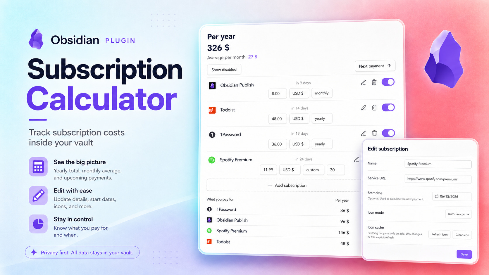

# Subscription Calculator

*See what your subscriptions really cost — without leaving Obsidian.*

Subscription Calculator gives you one clear place to track recurring payments, check upcoming charges, and understand your monthly and yearly spending.

## Made for your vault

Your subscription data stays in Obsidian without dependencies. You do not need a separate service, one note per subscription, Dataview, Bases, or frontmatter.

The plugin works offline. Website **icons** are fetched once and **cached locally**.

## Your subscriptions at a glance

- See the **total cost per year** and the **average per month**.
- **See upcoming** renewals when a start date is set.
- Add a service URL for its **favicon**.
- **Pause a subscription** without deleting it or including it in your totals.
- Keep different currencies separate, with no misleading conversions.
- Update the price, currency, or billing period directly from the subscription card.

**Sort by:**
  - Name
  - Status
  - Next payment

Choose from weekly, monthly, quarterly, yearly, or custom billing periods.

## Installation and usage

0. Install [**Subscription Calculator**](https://community.obsidian.md/plugins/subscription-calculator) from Obsidian Community plugins.
1. Open **Subscriptions** from the ribbon or the command palette.
2. Select **Add subscription** and enter its name, price, currency, and billing period.
3. Optionally add a start date for next-payment tracking or a service URL, then select **Add**.

Your totals and next payment dates update automatically. Use the switch on a subscription card to include or exclude it from your active spending. Open the edit menu whenever you want to change its details or use an emoji instead of the website icon.

## Supported currencies

Subscription Calculator includes USD, EUR, GBP, CHF, RUB, and JPY. Totals are shown separately for each currency instead of relying on changing exchange rates.

## Alternatives

Options for tracking subscriptions in Obsidian are limited in convenience, and most options are not quite about subscription tracking: they lean toward finance history, spread subscription data across many files, or live in external spreadsheets. That gap led to this plugin. Here is what I found.

**[fkonovalov/obsidian-subscription-tracker](https://github.com/fkonovalov/obsidian-subscription-tracker)** - The best option if you want subscription tracking built directly on Obsidian Bases. It is native and lightweight, with subscription notes, Bases formulas, favicon support, and multi-currency support through manually edited currency rates. The trade-off is that the workflow stays note-based: each subscription is a separate Markdown note with frontmatter.

**Expense and finance trackers** - Plugins like **[lberts/personal-finance](https://github.com/lberts/personal-finance)**, **[uuq007/obsidian-cashlog](https://github.com/uuq007/obsidian-cashlog)**, **[fengshuzi/coin-memo](https://github.com/fengshuzi/coin-memo)**, and **[thekalpit/tare-money](https://github.com/thekalpit/tare-money)** are about expenses, transactions, and money history. They can include subscription payments, but they do not treat subscriptions as a separate list of services to monitor.

**Ledger-based accounting tools** - **[mkshp-dev/obsidian-finance-plugin](https://github.com/mkshp-dev/obsidian-finance-plugin)** and **[bzimor/obsidian_hledger](https://github.com/bzimor/obsidian_hledger)** are built around Beancount or hledger workflows. They assume a ledger/accounting setup; Beancount Ledger also requires Python and local Beancount CLI packages. That is much broader and heavier than a lightweight subscription tracker.

<ins>**Custom Bases, Dataview, spreadsheets, and CSV workflows**</ins> - A similar tracker can be assembled with Bases views, Dataview queries, spreadsheets, or CSV files. This can be flexible, but it also means maintaining your own structure, views, sorting, and manual data files instead of using a focused subscription workflow.
