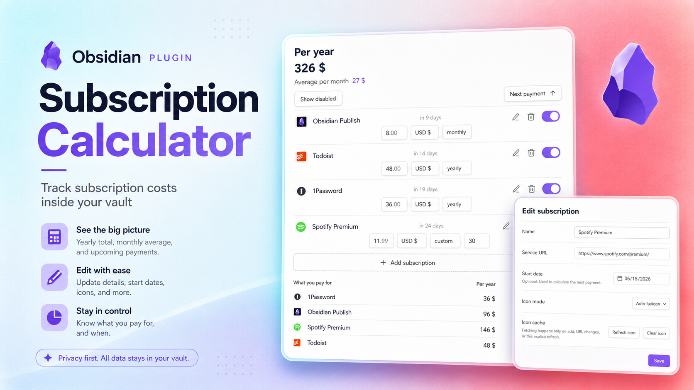

# Subscription Calculator

*See what your subscriptions really cost — without leaving Obsidian.*

Subscription Calculator gives you one clear place to track recurring payments, check upcoming charges, and understand your monthly and yearly spending.

## Made for your vault

Your subscription data stays in Obsidian without dependencies. You do not need a separate service, one note per subscription, Dataview, Bases, or frontmatter.

The plugin works offline. Website **icons** are fetched once and **cached locally**.

## Your subscriptions at a glance

- See the **total cost per year** and the **average per month**.
- **See upcoming** renewals when a start date is set.
- Add a service URL for its **favicon**.
- **Pause a subscription** without deleting it or including it in your totals.
- Keep different currencies separate, with no misleading conversions.
- Update the price, currency, or billing period directly from the subscription card.

**Sort by:**
  - Name
  - Status
  - Next payment

Choose from weekly, monthly, quarterly, yearly, or custom billing periods.

## Get started

1. Open **Subscriptions** from the ribbon or the command palette.
2. Select **Add subscription** and enter its name, price, currency, and billing period.
3. Optionally add a start date for next-payment tracking or a service URL, then select **Add**.

Your totals and next payment dates update automatically. Use the switch on a subscription card to include or exclude it from your active spending. Open the edit menu whenever you want to change its details or use an emoji instead of the website icon.

## Supported currencies

Subscription Calculator includes USD, EUR, RUB, GBP, CHF, and JPY. Totals are shown separately for each currency instead of relying on changing exchange rates.
